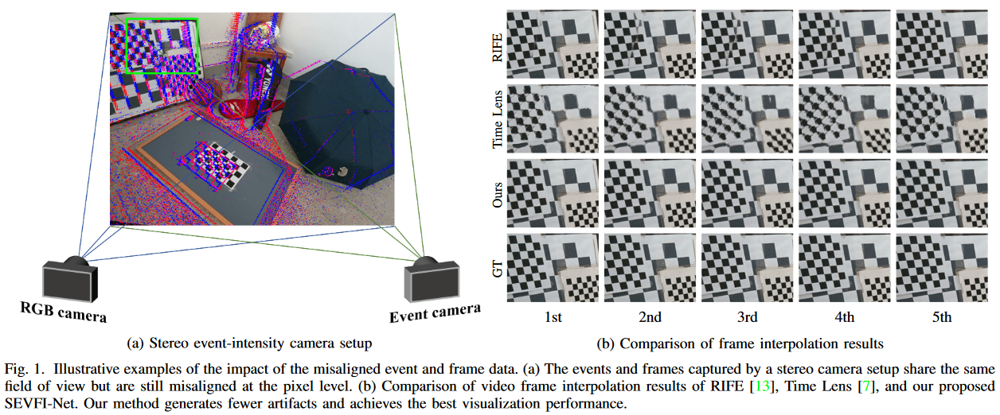
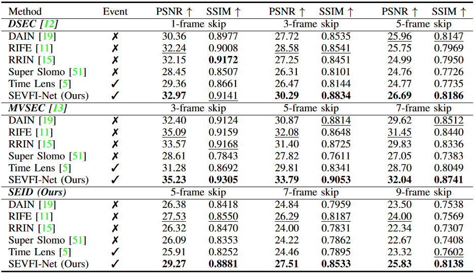

# Video Frame Interpolation with Stereo Event and Intensity Cameras
## [Paper](https://ieeexplore.ieee.org/abstract/document/10496813) | [Website](https://dingchao1214.github.io/web_sevfi/)

The stereo event-intensity camera setup is widely applied to leverage the advantages of both event cameras with low latency and intensity cameras that capture accurate brightness and texture information. However, such a setup commonly encounters cross-modality parallax that is difficult to be eliminated solely with stereo rectification especially for real-world scenes with complex motions and varying depths, posing artifacts and distortion for existing Event-based Video Frame Interpolation (E-VFI) approaches. To tackle this problem, we propose a novel Stereo Event-based VFI (SE-VFI) network (SEVFI-Net) to generate high-quality intermediate frames and corresponding disparities from misaligned inputs consisting of two consecutive keyframes and event streams emitted between them. Specifically, we propose a Feature Aggregation Module (FAM) to alleviate the parallax and achieve spatial alignment in the feature domain. We then exploit the fused features accomplishing accurate optical flow and disparity estimation, and achieving better interpolated results through flow-based and synthesis-based ways. We also build a stereo visual acquisition system composed of an event camera and an RGB-D camera to collect a new Stereo Event-Intensity Dataset (SEID) containing diverse scenes with complex motions and varying depths. Experiments on public real-world stereo datasets, i.e., DSEC and MVSEC, and our SEID dataset demonstrate that our proposed SEVFI-Net outperforms state-of-the-art methods by a large margin.

<center>
<div style="color:orange; border-bottom: 1px solid #d9d9d9;
    display: inline-block;
    color: #000;
    padding: 2px;">
  	</div>
    
    <br>
<!--     </div>
    
    <br> -->

## Environment setup
- python 3.7
- Pytorch 1.9.1
- opencv-python 4.6.0
- NVIDIA GPU + CUDA 11.1
- numpy, argparse, h5py

You can create a new [Anaconda](https://www.anaconda.com/products/individual) environment as follows.
<br>
```buildoutcfg
conda create -n sevfi python=3.7
conda activate sevfi
```
Clone this repository.
```buildoutcfg
git clone git@github.com:dingchao1214/SEVFI.git
```
Install the above dependencies.
```buildoutcfg
cd SEVFI
pip install -r requirements.txt
```

## Download models and data
[Pretrained models](https://whueducn-my.sharepoint.com/:f:/g/personal/2017301200038_whu_edu_cn/En3TsJ6ZVntBmtxFDXVQYkEBk5HKYSrfhPOfZCWhlaFrEg?e=O9gSqs) and [sample data](https://whueducn-my.sharepoint.com/:f:/g/personal/2017301200038_whu_edu_cn/EmzCkEVHkW9DmULQuhxjWmQBZkOhARxto2VWvoBIzG4A7A?e=bPDSDe) can be downloaded via OneDrive.
<br>
In our work, we conduct experiments on three real-world stereo event-intensity datasets:
<br>
- **[DSEC](https://dsec.ifi.uzh.ch/)** is a large-scale outdoor stereo event dataset especially for driving scenarios.
- **[MVSEC](https://daniilidis-group.github.io/mvsec/)** contains a single indoor scene and multi vehicle outdoor driving scenes. The events and frames are captured by two DAVIS346 cameras.
- **SEID** We build a stereo visual acquisition system containing an event camera and an RGB-D camera, and collect a new Stereo Event-Intensity Dataset. Our SEID captures dynamic scenes with complex motions and varying depths. (The data is coming soon.)

## Quick start
### Initialization 
- Copy the pretrined models to directory './PreTrained/'
- Copy the sample data to directory './sample/dataset/'

### Test
- Test on SEID data
```buildoutcfg
python test.py --dataset SEID --model_path ./PreTrained/ --origin_path ./sample/dataset/ --save_path ./sample/result/ --num_skip 5 --num_insert 5
```
- Test on DSEC data
```buildoutcfg
python test.py --dataset DSEC --model_path ./PreTrained/ --origin_path ./sample/dataset/ --save_path ./sample/result/ --num_skip 3 --num_insert 3
```
- Test on MVSEC data
```buildoutcfg
python test.py --dataset MVSEC --model_path ./PreTrained/ --origin_path ./sample/dataset/ --save_path ./sample/result/ --num_skip 5 --num_insert 5
```
**Main Parameters**:
- `--dataset`: dataset name.
- `--model_path`: path of models.
- `--origin_path`: path of sample data.
- `--save_path`: path of frame interpolation results.
- `--num_skip`: number of skip frames.
- `--num_insert`: number of insert frames.

## Citation
If you find our work useful in your research, please cite:
```buildoutcfg
@ARTICLE{10496813,
  author={Ding, Chao and Lin, Mingyuan and Zhang, Haijian and Liu, Jianzhuang and Yu, Lei},
  journal={IEEE Transactions on Multimedia}, 
  title={Video Frame Interpolation with Stereo Event and Intensity Cameras}, 
  year={2024},
  volume={},
  number={},
  pages={1-16},
  keywords={Cameras;Interpolation;Brightness;Task analysis;Estimation;Convolution;Kernel;Stereo event-intensity camera;video frame interpolation;stereo matching;stereo event-intensity dataset},
  doi={10.1109/TMM.2024.3387690}}
```
